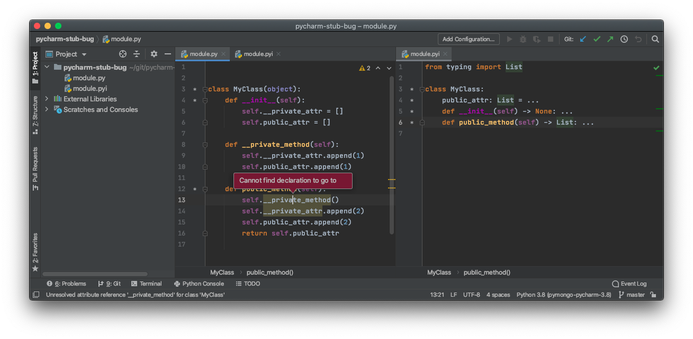

# pycharm-stub-bug

This is an example project which reproduces this PyCharm bug: https://youtrack.jetbrains.com/issue/PY-44648

When a stub file exists, PyCharm (version 20.2.2) fails to find declarations of
unannotated members within annotated methods.  

